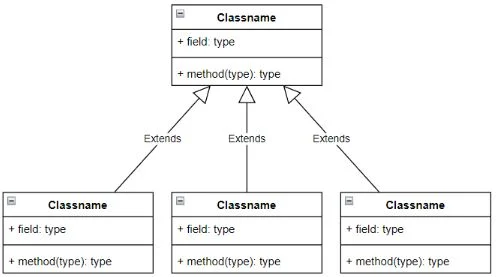

<p align="center"> 
<span style="color: red; font-weight: bold;">Escuela Politécnica Nacional</span>
<p align="center"> 
<span style="color: red; font-weight: bold;">Apuntes Programacion II - SEGUNDO BIMESTRE</span>


##### Nombre: Ariel David Mora Jarrin 
##### Curso: GR2SW
##### Fecha: 12 de Septiembre del 2023

---

<span style="color: purple; font-weight: bold;">CLASE 26 DE JULIO</span>
-


<p align="center"> 
<span style="color: red; font-weight: bold;">I. Estrategias para convertir un diagrama de Caso de Uso a un Diagrama UML</span>

<span style="color: blue; font-weight: bold;">Actores UC- UML:</span>

Cuando se trata de convertir un diagrama de Caso de Uso a un diagrama UML de clases, generalmente se asocia cada actor del diagrama de Caso de Uso con una clase en el diagrama de clases UML. Esto se hace para representar cómo las acciones que realiza cada actor están relacionadas con las clases y objetos del sistema.

De esta manera, 

- <span style="color: red; font-weight: bold;"> Asociación entre Actores y Clases: </span>: Cada actor en el diagrama de Caso de Uso se asocia con una o más clases en el diagrama UML de clases. Estas asociaciones representan la interacción entre los actores y las clases del sistema.

- <span style="color: red; font-weight: bold;"> Roles de Actores </span>: En algunos casos, un actor puede desempeñar diferentes roles en diferentes casos de uso. Estos roles pueden estar relacionados con diferentes clases en el diagrama de clases UML. 
  
- <span style="color: red; font-weight: bold;"> Relaciones entre Actores y Casos de Uso </span> : Además de las relaciones entre actores y clases, también debes tener en cuenta las relaciones entre actores y casos de uso. Los actores participan en casos de uso específicos, lo que se traduce en que interactúan con ciertas clases y objetos del sistema. 

- <span style="color: red; font-weight: bold;"> Detalles de Implementación </span> : La conversión de un diagrama de Caso de Uso a un diagrama de clases UML puede involucrar más detalles de implementación, como los métodos y atributos de las clases, las relaciones de herencia, agregación, composición, etc. 


<p align="center"> 
<span style="color: red; font-weight: bold;">Excepciones</span>

El manejo de excepciones es una parte fundamental de la programación que nos permite controlar y gestionar errores que pueden ocurrir durante la ejecución de un programa. 

<span style="color: red; ">*Datos importantes*</span>
- Cualquier particularidad se la puede manejar con un error.
- Se pueden generar errores propios, si el fin del código es generar un "break" en el programa.
- Los errores específicos se los suele colocar en los "locks". 

<span style="color: red; ">*Conceptos dentro de la estructura de una excepción*</span>


<span style="color: blue; ">**Try-Catch**</span>


- En un bloque try, se coloca el código que puede generar una excepción. Cuando ocurre una excepción en este bloque, el flujo de control se transfiere al bloque catch correspondiente, donde puedes manejar y tomar medidas específicas para ese error.

*Ejemplo*
```java 
try {
    // Código que puede generar una excepción
} catch (TipoDeExcepcion e) {
    // Manejar la excepción
}

}
``` 

<span style="color: blue; ">**Tipos de excepciones:**</span>
 
 - Algunos ejemplos comunes de tipos de excepciones en Java incluyen NullPointerException, ArithmeticException, FileNotFoundException, entre otros. Cada tipo de excepción se relaciona con un tipo específico de error.

<span style="color: blue; ">*Múltiples Bloques Catch*</span>

  Puedes tener múltiples bloques catch para manejar diferentes tipos de excepciones de manera personalizada. Esto te permite tomar acciones específicas según el tipo de error que se haya producido.

*Ejemplo*
```java 
try {
    // Código que puede generar una excepción
} catch (TipoDeExcepcion1 e) {
    // Manejar TipoDeExcepcion1
} catch (TipoDeExcepcion2 e) {
    // Manejar TipoDeExcepcion2
}

``` 


<span style="color: blue; ">**Finally (Finalmente)**</span>

- El bloque finally es opcional y se utiliza para ejecutar código que debe ejecutarse, independientemente de si se produce una excepción o no. Por ejemplo, es común utilizarlo para liberar recursos, como cerrar archivos o conexiones de bases de datos.

*Ejemplo*
```java 
try {
    // Código que puede generar una excepción
} catch (TipoDeExcepcion e) {
    // Manejar la excepción
} finally {
    // Código que se ejecutará siempre
}

``` 
 
---

<span style="color: purple; font-weight: bold;">CLASE 27-28 DE JULIO</span>
-

<p align="center"> 
<span style="color: red; font-weight: bold;">Arquitectura</span>


<span style="color: blue; ">**Diagrama Estructurales:**</span>

- Son estáticos y representan la estructura de un sistema.
- Muestran cómo se organiza y se relacionan los componentes.
- Los datos y las clases se representan de manera estática.
- Son ideales para comprender la arquitectura del sistema.
- Ejemplos incluyen diagramas de clases y diagramas de - objetos.


<span style="color: blue; ">**UML (Lenguaje de Modelado Unificado):**</span>


- UML es una técnica de modelado orientada a objetos ampliamente utilizada en la ingeniería de software.
- Proporciona un conjunto de notaciones y diagramas para representar sistemas y sus componentes.
- Es fundamental en la programación orientada a objetos.

<span style="color: blue; ">**Diagramas de Comportamiento:**</span>

- Representan cómo interactúan los componentes y cómo cambia el sistema con el tiempo.
- Muestran el flujo de control y la interacción entre objetos.
- Ayudan a comprender la dinámica del sistema.
- Ejemplos incluyen diagramas de casos de uso y diagramas de secuencia.

<span style="color: blue; ">**Diagrama de Casos de Uso (UC):**</span>

- Es uno de los diagramas de comportamiento más utilizados.
- Proporciona una vista general del sistema desde una perspectiva externa.
- Describe las interacciones entre actores (agentes externos) y casos de uso (funcionalidades del sistema).


<span style="color: blue; ">**Particularidades del Diagrama de Caso de Uso:**</span>

- Los actores externos que participan en el proceso se representan en el diagrama.
- Los escenarios se representan mediante "boundarys" y pueden incluir diferentes módulos.
- Los requerimientos funcionales son acciones realizadas por el sistema.
- Los requerimientos no funcionales son aspectos técnicos, como la encriptación de contraseñas.
- Los requerimientos se desarrollan de acuerdo al contexto del sistema.
- La relación de generalización se representa con una flecha que apunta al padre, indicando que una entidad más específica se deriva de una entidad más general.
- La relación "Include" es obligatoria y sigue el flujo de ejecución.
- La relación "Extend" es opcional y no sigue un flujo lineal.
- "Jerarquía" es un sinónimo de generalización y se utiliza para representar la relación entre clases o casos de uso.

---

<span style="color: blue; ">**Plantillas Caso de Uso:**</span>

Es una descripción mucho más amplia en la que se detalla el requerimiento funcional que realiza el actor.

<span style="color: blue; ">**Diagrama de Clase:**</span>

- Es un diagrama estático que representa el esqueleto del sistema.
- En el diagrama de clases se pueden ver clases, atributos, operaciones y relaciones entre objetos y clases. 
- Existe una diferencia entre clases y objetos en el diagrama.

<span style="color: blue; ">**Modelado Orientado a Objetos (O.O):**</span>

- A partir de una plantilla, permite definir las propiedades de un objeto.
- La instancia ocurre cuando las propiedades tienen valores asignados.
- Al crear un objeto, se le asignan valores a sus propiedades.
- Los métodos de un objeto deben utilizar las propiedades del mismo.
- Al crear un método, es necesario determinar qué propiedades va a utilizar.

<span style="color: blue; ">**Clase:**</span>

- Una clase consta de tres partes: nombre, propiedades y métodos. Puede tener una parte adicional relacionada con eventos.
- Una clase se considera incompleta cuando no especifica el tipo de dato o los parámetros que recibe, así como si sus métodos son procedimientos o funciones.
- El modificador "protected" permite que las clases dentro del mismo paquete o aquellas relacionadas por herencia accedan a las propiedades.
- Al importar un paquete, solo se pueden ver las partes públicas de las clases.
Parámetros:

<span style="color: blue; ">**"inout":**</span> 

- Este tipo de parámetros entra en la clase, se modifica y sale con el valor modificado.
  
<span style="color: blue; ">**"out":**</span>  

- Estos parámetros se utilizan en el diseño de software y en bases de datos.
Perspectivas del Diagrama de Clases:


<span style="color: blue; ">**Herencia:**</span> 


- La herencia de abajo hacia arriba se llama generalización, de arriba hacia abajo se llama extensión.
Beneficios de la Herencia:

- Permite administrar el código y las propiedades, ya que se heredan a las clases hijas, evitando tener que repetirlas en cada clase.
Nomenclatura:

- Se representa con una línea continua y una flecha hueca.

<span style="color: blue; ">**Generalidad:**</span> 


- Las características comunes de dos clases se colocan en la clase padre para que se hereden a ambas.
Especificidad:

- Son particularidades de cada clase.
  
<span style="color: blue; ">**Ventajas de la Herencia:**</span> 

- Reutilización de código.

<span style="color: blue; ">**Desventajas de la Herencia:**</span> 


- Aumenta el acoplamiento.




---

<span style="color: purple; font-weight: bold;">CLASE 8 DE AGOSTO</span>
-

<p align="center"> 
<span style="color: red; font-weight: bold;">Arquitectura N-tier (Arquitectura en Capas)</span>

La arquitectura N-tier, también conocida como arquitectura en capas, es un enfoque común en el desarrollo de software que divide una aplicación en múltiples capas o niveles. Cada capa cumple con una función específica y se comunica con las capas adyacentes según un conjunto de reglas definidas. Esta arquitectura se utiliza para lograr la separación de preocupaciones y facilitar el mantenimiento y la escalabilidad de las aplicaciones.

*Las capas típicas en una arquitectura N-tier son:*

<span style="color: red; font-weight: bold;">Capa de acceso a datos DAC:</span>

- Encargada de interactuar con las fuentes de datos, como bases de datos, servicios web, archivos, etc.
- Realiza operaciones de lectura y escritura en la base de datos según las solicitudes de la capa de lógica de aplicación.
- Abstrae la complejidad de las operaciones de base de datos.

*Ejemplo*
```java 
package DataAccess;

import java.sql.ResultSet;
import java.sql.SQLException;

import FrameWork.AppException;

public class MNArsenalDAC extends SQLiteDataHelper {
    public MNArsenalDAC() throws AppException {
        super();
    }
    /**
     * mnInsertarDatos: Este metodo se encarga de insetar datos en la tabla "MN_ARSENAL"
     * @param mnDato: Reprsenta al nombre del Arsenal.
     */
    public void mnInsertarDatos(String mnDato){
        String insertSQL= "INSERT INTO MN_ARSENAL" + " (NombreArsenal) " +
           "VALUES ( ?)";
        try  {
            mnPreparedSt = mnConn.prepareStatement(insertSQL);
            mnPreparedSt.setString(1,mnDato );
            mnPreparedSt.executeUpdate();       
            
        } catch (SQLException e) {
            e.printStackTrace();
        }
    }
    /**
     * mnGetAll: Este metodo permite obtener la informacion de la base de datos y lo almacena en un ResultSet.
     */
    @Override
    public ResultSet mnGetAll() throws AppException {
        mnConsultaSQL= "SELECT NombreArsenal  FROM MN_ARSENAL";
        
        return mnGetResulSet(mnConsultaSQL); 
    }
}

``` 

<span style="color: red; font-weight: bold;">Capa de Lógica de Aplicación (Business Logic Layer):</span>

Contiene la lógica de negocio de la aplicación.
Procesa las solicitudes del usuario y realiza operaciones específicas para cumplir con los requisitos funcionales.
Se comunica con la capa de acceso a datos para recuperar o modificar información.

*Ejemplo*
```java 
package BusinessLogic;

import java.sql.ResultSet;
import java.sql.SQLException;
import java.util.ArrayList;
import java.util.HashSet;
import java.util.List;

import BusinessLogic.Entities.MNArsenalTipo;
import DataAccess.MNArsenalTipoDAC;
import FrameWork.AppException;

public class MNArsenalTipoBL {
    MNArsenalTipoDAC mnArsenalTipoDAC;
    public MNArsenalTipoBL () throws AppException{
       mnArsenalTipoDAC = new MNArsenalTipoDAC();
    }
    /**
     * mnSetAllData: Este método se encarga de mandar la informacion que hay en la lista ArsenalTipo, al DAC. 
     * @param mnArsenalTipoNombre: Representa la lista que contiene la informacion del tipo de Arsenal.
     */
    public  void mnSetAllData (HashSet<String> mnArsenalTipoNombre){
        for (String mnArsenalTipoStr : mnArsenalTipoNombre) {
            mnArsenalTipoDAC.mnInsertarDatos(mnArsenalTipoStr);
        }
    }
    /**
     * mnGetAll:Este metodo se encarga de insertar la informacion obtenida por el DAC,  en una lista 
     * correspondiente a la entidad ArsenalTipo.
     * @return List<MNArsenalTipo>: Representa a una lista de Arsenal Tipo.
     * @throws AppException
     */
    public List<MNArsenalTipo> mnGetAll() throws AppException {
        ResultSet mnRs = mnArsenalTipoDAC.mnGetAll();
        List<MNArsenalTipo> mnListaArsenalTipo = new ArrayList<>();
        MNArsenalTipo mnArsenalTipo;
        try {
            while (mnRs.next()) {
                mnArsenalTipo = new MNArsenalTipo();
                mnArsenalTipo.setNombreArsenalTipo(mnRs.getString(2));
                mnListaArsenalTipo.add(mnArsenalTipo);
            }
                mnRs.close();
                return mnListaArsenalTipo;
        } catch (SQLException e) {
            throw new AppException(e, getClass(), "mnGetAll()");
        }
    }
}


``` 
<span style="color: red; font-weight: bold;">Capa de Interfaz Gráfica (UI):</span>

También conocida como la capa de interfaz de usuario.
Responsable de mostrar la información al usuario y recopilar sus entradas.
Puede incluir interfaces de usuario, formularios web, aplicaciones móviles, etc.
No debe contener lógica de negocio, sino que se comunica con la capa de lógica de aplicación.


*Ejemplo*
```java 
package UserInterface;

import javax.swing.JFrame;
import javax.swing.JLabel;
import javax.swing.JPanel;

import FrameWork.AppException;

import java.awt.*;
import java.io.IOException;
import java.sql.SQLException;

public class FrameTabla extends JFrame {
    private final String MN_TITULO = "Examen Segundo Bimestre";
    private final int    MN_ANCHO  = 1200;
    private final int    MN_ALTO   = 600;
    private JPanel mnPanelTitulo;
    private JLabel mnLblTitulo;

    /**
     * Constructor de la clase FrameTabla
     * @throws IOException
     * @throws AppException
     * @throws SQLException
     */
    public FrameTabla() throws IOException, AppException, SQLException {
        mnSetCustomization();
        mnInitComponents();
        mnAddComponents();
    }

    /**
     * mnSetCustromization: establece una personalización a la ventana
     */
    private void mnSetCustomization() {
        setTitle(MN_TITULO);
        setSize(MN_ANCHO, MN_ALTO);
        setLayout(new BorderLayout());
        setLocationRelativeTo(null);
        setResizable(false);           
        setDefaultCloseOperation(EXIT_ON_CLOSE);

    }

    /**
     * mnInitComponents: inicializa los componentes que se estarán presentes en la ventana
     */
    private void mnInitComponents() {
        Font mnFuente = new Font("Arial", Font.BOLD, 20);     
        mnLblTitulo = new JLabel("Datos Interceptados");
        mnLblTitulo.setFont(mnFuente);
        mnPanelTitulo = new JPanel();
        mnPanelTitulo.setPreferredSize(new Dimension(0, 50));

        mnPanelTitulo.setLayout(new FlowLayout());
    }

    /**
     * mnAddComponents: agrega los componentes a cada contenedor para darle estructura a la interfaz gráfica
     * @throws IOException
     * @throws AppException
     * @throws SQLException
     */
    private void mnAddComponents() throws IOException, AppException, SQLException {
        mnPanelTitulo.add(mnLblTitulo);
        add(mnPanelTitulo ,BorderLayout.NORTH);
        add(new PanelTabla(), BorderLayout.CENTER);
    }

}


``` 

<span style="color: red; font-weight: bold;">Capa de Seguridad (Security Layer):</span>

Administra la seguridad y la autenticación de la aplicación.
Protege los recursos de la aplicación y garantiza que solo los usuarios autorizados tengan acceso a ellos.

*Ejemplo*
```java 
package FrameWork;

public class AppException extends Exception  {
    public AppException(Throwable cause, Object className, String message) {
        super(className +":"+message, cause);
        setDebuggingLog();
    }

    public AppException(Throwable cause, Object className) {
        super(className +":" + "Error no especificado", cause);
        setDebuggingLog();
    }

    public AppException(String message) {
        super("Error en clase no especificada "+":"+message);
        setDebuggingLog();
    }

    void setDebuggingLog(){
        System.out.println("-------------------------");
        System.out.println("{AppExceptionAriel}");
        System.out.println(getMessage());
        System.out.println(getCause());
        System.out.println("-------------------------");
    }
}
``` 
<span style="color: red; font-weight: bold;">Beneficios de la Arquitectura Empresarial</span>

- Escalabilidad: La arquitectura empresarial permite escalar fácilmente los componentes de la aplicación, como la base de datos, los servidores dedicados y las capas lógicas, para adaptarse a las necesidades de crecimiento.

- Escalado Horizontal y Vertical: Se puede realizar un escalado horizontal y vertical según las necesidades. Por ejemplo, el escalado horizontal se puede aplicar a la capa de Lógica de Negocio (BL), lo que implica agregar más servidores para manejar la carga.

- Tinder Pet: Las "fachadas" (facade) representan las entidades lógicas y las interfaces que facilitan la comunicación entre las diferentes capas. Estas fachadas ayudan a organizar y simplificar la interacción entre las capas del sistema.

- Proceso de Comunicación: La arquitectura empresarial permite la comunicación entre diferentes lenguajes de programación, lo que significa que diferentes partes del sistema pueden estar escritas en lenguajes diferentes y aún así comunicarse eficazmente.


---
<p align="center"> 
<span style="color: red; font-weight: bold;">Base de Datos</span>


<span style="color: red; ">**Clase que se comunica con la base de datos**</span> 

<span style="color: blue; ">Data Helper</span> 

- La clase Data Helper es una clase abstracta que se encarga de interactuar con la base de datos. Realiza operaciones CRUD y actúa como un filtro que calibra la información que se envía y se recibe entre la aplicación y la base de datos.

<span style="color: blue; ">**Cambio de la Base de Datos**</span> 

- Cambiar la base de datos es relativamente sencillo en la arquitectura empresarial. Solo es necesario modificar la clase Data Helper que interactúa con la base de datos. Si se desean múltiples bases de datos, se pueden crear varios Data Helpers.


<span style="color: blue; ">**SQLite**</span> 


- SQLite es un sistema de gestión de bases de datos relacionales que se utiliza en aplicaciones móviles y de escritorio. Para comunicarse con SQLite, se requiere un controlador JDBC que permita ejecutar operaciones CRUD (Crear, Leer, Actualizar, Borrar) en la base de datos.

<span style="color: blue; ">**CRUD (Crear, Leer, Actualizar, Borrar)**</span> 


- CRUD es un conjunto de operaciones básicas que permiten crear, leer, actualizar y borrar datos en una base de datos. Estas operaciones son fundamentales para la manipulación de información en una aplicación.


<span style="color: blue; ">**JDBC (Java Database Connectivity**</span> 


- JDBC es una API de Java que proporciona una interfaz para conectarse a bases de datos y ejecutar operaciones SQL. Se utiliza para comunicarse con la base de datos SQLite y realizar operaciones CRUD.

<span style="color: red; ">**Tipos de Escalado**</span> 


<span style="color: blue; ">**Escalado Vertical y Horizontal**</span> 


- El escalado vertical implica agregar más recursos (como CPU y RAM) a un servidor existente para mejorar su rendimiento. Se utiliza para aplicaciones que no se pueden dividir fácilmente en múltiples servidores.

<span style="color: blue; ">**Extensiones de SQLite**</span> 

Las extensiones de SQLite son componentes que permiten la comunicación entre el entorno de desarrollo (IDE) utilizado y la base de datos SQLite.
Librerías y Clases para Trabajar con Bases de Datos
Connection: Representa una conexión con la base de datos.

- DriverManager: Administra la información de la base de datos y permite establecer conexiones.

- ResultSet: Permite obtener resultados o información de consultas a la base de datos.

- SQLException: Maneja las excepciones que pueden ocurrir al trabajar con la base de datos.

- Statement: Representa sentencias SQL que se envían al servidor de la base de datos.

<span style="color: blue; ">**Clase Data Helper Abstracta**</span> 

- La clase Data Helper es abstracta porque proporciona una estructura común y métodos genéricos para interactuar con la base de datos. Se espera que las clases concretas que interactúan con bases de datos específicas hereden de esta clase y proporcionen implementaciones concretas de los métodos para cada base de datos.


---

<span style="color: purple; font-weight: bold;">CLASE 11 DE AGOSTO</span>
-

<p align="center"> 
<span style="color: red; font-weight: bold;">Como trabajar con la base de datos</span>

<span style="color: blue; ">**Entidades y Operaciones CRUD**</span> 

- Para trabajar con las entidades (por ejemplo, "Mascota"), es necesario tener clases que permitan realizar operaciones CRUD (Crear, Leer, Actualizar y Borrar). Cada entidad debe tener su propio conjunto de operaciones CRUD para gestionar la información relacionada con esa entidad.

- Cada entidad puede instanciar un objeto "Data Helper" que se comunica con la base de datos y proporciona métodos para realizar operaciones CRUD en esa entidad. Sin embargo, una desventaja es que para cada entidad de negocio, se requiere un objeto "Data Helper" separado, lo que puede generar un desgaste de memoria.

<span style="color: red; ">**Maneras Alternativas para Evitar el Desgaste de Memoria**</span> 

<span style="color: blue; ">*Manera 1: Uso de Métodos Estáticos*</span> 

Una alternativa es utilizar métodos estáticos para realizar operaciones CRUD en lugar de instanciar objetos "Data Helper". Sin embargo, esto no es una práctica típica de la programación orientada a objetos.

*Ejemplo*
```java 
public class Mascota {

    private int id;
    private String nombre;
    private String tipo;
    public static void crearMascota(String nombre, String tipo) {

    }

    public static Mascota obtenerMascotaPorId(int id) {

        return null; 
    }

    public static void actualizarMascota(Mascota mascota) {

    }

    public static void borrarMascotaPorId(int id) {
    }
}

``` 
<span style="color: blue; ">*Desventajas de esta enfoque:*</span> 

- Los métodos CRUD deben implementarse en cada entidad, lo que puede llevar a una duplicación de código.
Se debe especificar la base de datos en cada método, lo que no es escalable si el programa crece y requiere cambios en la base de datos.

<span style="color: blue; ">*Manera 2: Uso de Interfaces*</span> 

- Otra opción es utilizar interfaces para definir los métodos CRUD que deben implementarse en cada entidad. Sin embargo, esto no proporciona implementaciones de código concretas, solo define las firmas de los métodos.
*Ejemplo*
```java 
public interface EntidadCRUD {

    void crear();
    
    void leer(int id);
    
    void actualizar();
    
    void borrar(int id);
}
``` 

<span style="color: blue; ">*Manera 3: Uso de Clase Abstracta*</span> 

- Una solución más sólida es utilizar una clase abstracta que combine la potencia de la herencia con la flexibilidad de los métodos estáticos. Esta clase abstracta proporciona métodos CRUD genéricos que se pueden implementar y utilizar directamente en las clases de acceso a datos (DAC) de cada entidad.

*Ejemplo*
```java 
public abstract class DataHelper<T> {

    public void crear(T entidad) {
    }

    public T leer(int id) {
        return null; 
    }

    public void actualizar(T entidad) {

    }

    public void borrar(int id) {

    }
}

``` 
```java 
public class MascotaDAC extends DataHelper<Mascota> {

}

``` 

<span style="color: blue; ">*Ventajas de esta enfoque:*</span> 


- La clase abstracta es una única ventana de acceso a los métodos CRUD.
- No es necesario instanciarla para utilizar los métodos de la clase "Data Helper".
- Todas las clases de acceso a datos (DAC) pueden heredar de esta clase abstracta y aprovechar sus métodos, lo que evita crear objetos internos para cada entidad.

<span style="color: blue; ">*Service Agent:*</span> 

- La capa de Service Agent representa una capa intermedia que se encarga de tratar información más allá de las bases de datos. Puede interactuar con fuentes de datos en la nube, sensores u otras fuentes de información.

- En lugar de utilizar clases "Data Helper," se pueden utilizar API para comunicarse con estas fuentes de datos. Las API permiten la inyección de información y la conexión a la nube o sensores.

- La comunicación ya no se realiza mediante archivos JAR, sino a través de API que facilitan la comunicación y el tratamiento de datos en diferentes entornos.

---

<p align="center"> 
<span style="color: red; font-weight: bold;">SQLite</span>

- SQLite es un sistema de gestión de bases de datos relacionales que se utiliza comúnmente en aplicaciones móviles y sistemas embebidos debido a su naturaleza ligera y su fácil integración.


*Aquí se presentan algunos aspectos importantes relacionados con la estructura de una base de datos en SQLite y cómo se gestionan los datos:*

<span style="color: blue; ">*Paradigma de Información en Base de Datos*</span> 
  
- SQLite almacena información en tablas, lo que sigue el paradigma de una base de datos relacional. Cada tabla se asemeja a una hoja de cálculo en la que se pueden almacenar datos del mundo real.


<span style="color: blue; ">*Aspectos Importantes en el Tratado de la Información*</span> 

- Es una buena práctica utilizar un identificador único llamado Primary Key (PK) en lugar de nombres de usuarios u otros atributos como identificadores. Esto mejora la eficiencia y evita problemas de duplicación de datos.
- Todas las tablas deben tener una columna PK que sirva como identificador único.
- La normalización es una técnica importante para organizar datos en tablas de manera eficiente y evitar redundancia.
Base de Datos Relacionales

<span style="color: red; ">*SQLite sigue las reglas de las bases de datos relacionales, que se dividen en tres reglas principales:*</span> 

<span style="color: blue; ">*Primera Regla:*</span> 


- Relación de uno a uno, donde un registro en una tabla se relaciona con exactamente un registro en otra tabla.

<span style="color: blue; ">*Segunda Regla:*</span> 

- Relación de uno a muchos, donde un registro en una tabla puede relacionarse con cero, uno o muchos registros en otra tabla.

<span style="color: blue; ">*Tercera Regla:*</span> 

- Relación de muchos a muchos, donde múltiples registros en una tabla pueden relacionarse con múltiples registros en otra tabla mediante una tabla de unión.


<span style="color: red; ">*Ejemplo de Relación Uno a Muchos*</span> 


- En el caso de una relación uno a muchos, como la relación entre un dueño y sus mascotas, se pueden tener múltiples mascotas relacionadas con un solo dueño. Aquí, las mascotas no pueden existir sin un dueño y, por lo tanto, la relación es uno a muchos.

<span style="color: red; ">*Relación entre FK y PK (Llave Externa y Llave Primaria)*</span> 

- La relación entre una clave externa (FK) y una clave primaria (PK) es fundamental en una base de datos relacional. Si deseas buscar un registro en una tabla relacionada, la FK debe coincidir con la PK correspondiente en la tabla principal.


<span style="color: red; ">*Integridad Referencial*</span> 


- Las restricciones de integridad referencial, como las restricciones de clave externa (FK) y clave primaria (PK), garantizan la consistencia y evitan datos duplicados en la base de datos.

*Gráfico sobre los conceptos, estipulados anteriormente*


<span style="color: purple; font-weight: bold;">CLASE 16 DE AGOSTO</span>
-

<span style="color: red; ">**Modelado entidad relacion**</span>
- El Modelo Entidad-Relación (MER) es una técnica de modelado de datos que se utiliza para diseñar bases de datos relacionales. Este modelo se basa en la representación de entidades, atributos y relaciones entre entidades. Aquí se presentan aspectos clave relacionados con el MER:

<span style="color: red; ">**Entidades:**</span>


- Las entidades representan objetos o conceptos del mundo real que se almacenan en la base de datos. Por ejemplo, en un sistema académico, las entidades podrían incluir "Estudiante", "Profesor" y "Curso".
Atributos:

- Los atributos son las características o propiedades que describen una entidad. Por ejemplo, un "Estudiante" puede tener atributos como "Nombre", "Apellido", "Número de Estudiante", etc.
Relaciones:

- Las relaciones representan cómo las entidades se conectan o interactúan entre sí. Las relaciones pueden ser de uno a uno, uno a muchos o muchos a muchos. Por ejemplo, un "Estudiante" puede estar inscrito en varios "Cursos", lo que representa una relación uno a muchos.

<span style="color: red; ">**Máxima Relación Uno a Muchos:**</span>

- En un modelo entidad-relación, la máxima relación posible entre dos entidades es de uno a muchos. Esto significa que una entidad puede estar relacionada con múltiples instancias de otra entidad, pero cada instancia de la segunda entidad está relacionada con una sola instancia de la primera entidad.


<span style="color: red; ">**Identificadores Únicos:**</span>

- Cada entidad debe tener un atributo que actúe como su identificador único. En la mayoría de los casos, se utiliza un campo llamado "ID" que es de tipo entero y suele ser autoincremental. Esto asegura que cada instancia de una entidad tenga un valor único que la identifique.

<span style="color: red; ">**Campos Computados:**</span>

- Los campos computados son atributos que se calculan automáticamente en función de otros atributos o datos en la base de datos. Estos campos pueden utilizarse para realizar cálculos o aplicar restricciones a los datos.

<span style="color: red; ">**Repetición de Datos:**</span>

- En una base de datos relacional, se busca evitar la repetición innecesaria de datos. Esto se logra a través de la normalización, que consiste en organizar los datos en tablas de manera eficiente y sin redundancia.

**Ejemplo de MER**


<span style="color: red; ">**Base de Datos- SHEMA**</span>


- En el contexto de las bases de datos relacionales, un "schema" (esquema en español) es una estructura lógica que define cómo se organizarán y agruparán los objetos de la base de datos, como tablas, vistas, funciones, procedimientos almacenados, etc. Cada base de datos puede contener uno o varios esquemas, y estos esquemas ayudan a mantener organizados los objetos relacionados dentro de la base de datos.


Aquí hay algunos aspectos clave sobre los esquemas y el uso de archivos schema.sql:


<span style="color: blue; ">**1. Definición de Estructura de la Base de Datos:**</span>


- El archivo schema.sql se utiliza para definir la estructura inicial de la base de datos. Puede contener declaraciones SQL que crean tablas, vistas, índices y otros objetos de la base de datos.
Las declaraciones SQL en este archivo suelen incluir comandos como CREATE TABLE, CREATE VIEW, CREATE INDEX, entre otros, que definen la estructura de los objetos de la base de datos.

*Ejemplo de un archivo SHEMA.sql*


<span style="color: purple; font-weight: bold;">CLASES 23,29 y 30  DE AGOSTO</span>
-

<p align="center"> 
<span style="color: red; ">Manejo de Errores</span>

- Se usan bloques try-catch para capturar errores.
- Se pueden tener varios tipos de errores.
- AppException maneja excepciones en la aplicación. Se puede crear una AppException para poder manejar los errores de una forma más personalizada.

*Ejemplo de código*
```java 
package Framework;

public class AppException extends Exception {
    public AppException(Throwable cause, Object className, String message) {
        super(className + ":" + message, cause);
        setDebuggingLog();
    }

    public AppException(Throwable cause, Object className) {
        super(className + ":" + "Error no especificado", cause);
        setDebuggingLog();
    }

    public AppException(String message) {
        super("Error no especificado" + ":" + message);
        setDebuggingLog();
    }

    void setDebuggingLog() {
        System.out.println("{AppException}");
        System.out.println(getMessage());
        System.out.println(getCause());
    }
}


``` 

<span style="color: red; ">Parametrización</span>

- Se usa para hacer consultas con parámetros.
- PreparedStatement prepara la consulta y asigna valores a los parámetros.
```java 
import java.sql.Connection;
import java.sql.DriverManager;
import java.sql.PreparedStatement;
import java.sql.ResultSet;
import java.sql.SQLException;

public class ParametrizacionEjemplo {
    public static void main(String[] args) {
        String jdbcURL = "jdbc:mysql://localhost:3306/mi_basededatos";
        String usuarioDB = "usuario";
        String contraseñaDB = "contraseña";

        try {
            Connection conexion = DriverManager.getConnection(jdbcURL, usuarioDB, contraseñaDB);
            
            // Consulta SQL parametrizada
            String consulta = "SELECT nombre FROM empleados WHERE salario > ?";
            
            // Crear PreparedStatement con la consulta
            PreparedStatement preparedStatement = conexion.prepareStatement(consulta);
            
            // Establecer valor del parámetro
            double salarioMinimo = 30000.0;
            preparedStatement.setDouble(1, salarioMinimo);
            
            // Ejecutar la consulta
            ResultSet resultado = preparedStatement.executeQuery();
            
            // Procesar los resultados
            while (resultado.next()) {
                String nombreEmpleado = resultado.getString("nombre");
                System.out.println("Empleado con salario mayor a " + salarioMinimo + ": " + nombreEmpleado);
            }
            
            // Cerrar recursos
            resultado.close();
            preparedStatement.close();
            conexion.close();
        } catch (SQLException e) {
            e.printStackTrace();
        }
    }
}

``` 


<span style="color: red; ">Pasos para el  desarrollo de la Interfaz de Usuario</span>


- Personalización de elementos con font.
- Creación de métodos para interactuar con los controles.
- Uso de setEditable(false) para bloquear la edición.
- GridBagConstraints controla la disposición de elementos.
- Comunicación de la interfaz con la BL.


<span style="color: red; ">DTO (Data Transfer Object)</span>

- Une datos de varias tablas.
- Útil para trabajar con múltiples entidades a la vez.
- Involucra información de varias tablas en un solo objeto.
- Principalmente utilizado para obtener información de la base de datos.
- No permite insertar, eliminar ni actualizar datos.
- ResultSet se utiliza para devolver conjuntos de datos desde el DTO.

*Ejemplo de Código DTO*

```java 
package DataAccess;

import java.sql.Connection;
import java.sql.ResultSet;
import java.sql.SQLException;
import java.sql.Statement;

import FrameWork.AppExceptionAriel;

public class LibroFullDTO extends SQLiteDataHelper {

    public  ResultSet getAllData() throws AppExceptionAriel{
        String query = "SELECT ra.Resena AS Comentario, lib.NombreLibro AS Libro, au.NombreAutor AS Autor " +
                       "FROM RESENA ra " +
                       "JOIN LIBRO lib ON lib.IdLibro = ra.IdLibro " +
                       "JOIN AUTOR au ON au.IdAutor = ra.IdAutor " ;
         try{
            Connection connection = openConnection();
             Statement stmt = connection.createStatement();
             ResultSet resultSet = stmt.executeQuery(query);
             return resultSet;
         }catch(SQLException e) {
            throw new AppExceptionAriel(e, getClass(),"getAllData()");
        }
    }

}


``` 


