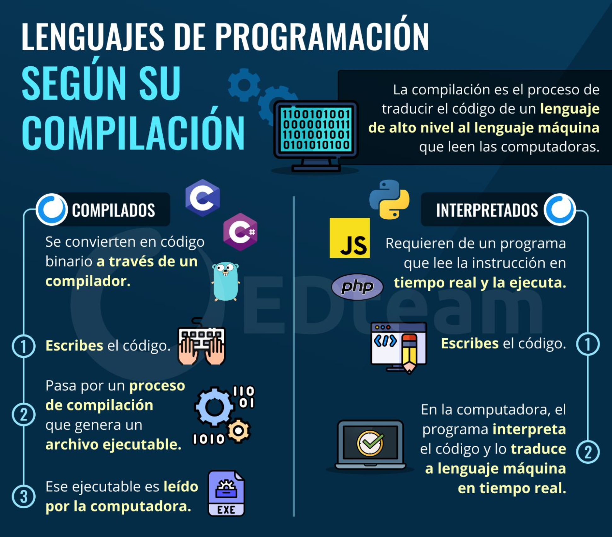
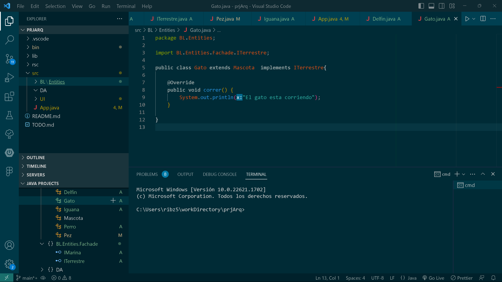

<p align="center"> 
<span style="color: red; font-weight: bold;">Escuela Politécnica Nacional</span>
<p align="center"> 
<span style="color: red; font-weight: bold;">Apuntes Programacion II</span>


##### Nombre: Ariel David Mora Jarrin 
##### Curso: GR2SW
##### Fecha: 7 de Julio del 2023

---
<p align="center"> 
<span style="color: red; font-weight: bold;">I. Introduccion Visual code</span>

<span style="color: blue; font-weight: bold;">Comandos Visual Code </span>
> **Shift + Control + P** :Abre el area de comandos.

> **Control + Shift +_** : Abre la consola. 

> **Control + P**: Busca los archivos 

> **Control + D**: Multicursor 

> **Alt + (Flecha Arriba)+ (Flecha Abajo)**: Mover entre lineas. 

> **Alt + shift + (Flecha Arriba)+ (Flecha Abajo)**: Duplicar Linea. 

> **ctrl + x**: Quitar linea. 

> **ctrl + K+ C**: Comentar. 

> **ctrl + K+ U**: Descomentar.
 
> **ctrl + espacio**: Interlicense.

> **Tab**: Completar linea de codigo. 

> **ctrl + ñ**: Aparece y desaparece la consola. 

##### Comandos Consola 
> **ctrl + ñ**: Levantar consola 

> **ctrl + L**: Limpiar consola 

> **ctrl + s**: Presentar archivos. 

> **pwd**: Ver ruta de los archivos. 

> **ls**: Listar, permite ver los directorios y los archivos. 

> **ls-l-** : Permite observar, los directorios, nombres y las fechas de los archivos. 

> **ls-a** : Permite ver todos. 

> **ctrl + L**: Limpia la pantalla. 

> **cd ..**: Permite salir de los archivos.
 
> **cd/.** : Lleva a la raiz de los archivos. 

> **cd c/u + tab**: Lleva a un directorio vivo. 

> **cat file-txt**: Permite lo que tiene un archivo. 

> **touch file2.txt**: Permite crear un archivo.

> **code file.txt**: Permite lanzar el archivo al visual code. 

> **rm file.txt** : Permite borrar los archivos. 

> **ls**: Permite saber el contenido. 

> **rm*.txt**: Permite borrar todos los archivos que terminen en txt. 

> **mkdir dir1**: Crea un directorio

> **touch dir1/file1.txt**: Crea un archivo dentro de un directorio. 

> **mv dir1/file1.txt dir2/**: Permite mover un archivo de un directorio a otro.
 
> **cp**: copiar archivos.

> **vi dir3/file.txt**: Entra al archivo y permite escribir texto. 

> **ps** Permite ver los procesos que estan corriendo dentro del computador. 

> **history**: Devuelve el historial de comandos.
 
> **history >> clases.txt** : Guarda el historial en un archivo txt.

---

<p align="center"> 
<span style="color: red; font-weight: bold;">II. Introduccion a Git </span>


###### Caracteristicas: 
* Fue creado en el 2005 por Linus Torvalds. 
* Herramienta de desarrollo colaborativo de software. 
* Plataformas online: GitHub 
* Proyecto de codigo abierro que se caracteriza por ser el sistema de control de versiones mas utilizado en el mundo. 
* La plataforma esta creada para que los desarrolladores suban el codigo de sus aplicaciones y herramientas. 

##### Aspectos esenciales dentro de los comandos de git:
###### **Tu identidad**: Informacion del usuario 

> **$ gitconfig--global user.name "Emma Paris“**
> establece un nombre que sea identificable 
>**git config --global user.email “[valid-email]”**
> establece una direccion de correo electronico

###### **Configuracion e Inicio**: Configura la informacion del usuario, inicializacion y clonacion de repositorios. 

> **git init**
> inicializa el directorio como un repositorio de Git 
>**git clone [url]**
> recupera un repositorio a partir de un URL

###### **COntrol de Versiones** : Trabaja con areas para la preparacion del Git. 

> **git status**
> Muestra archivos modificados dentro del directorio de trabajo. 
>**git add [file]**
> Agrega un archivo
> **git reset [file]**
> Elimina un archivo 
>**git diff**
> Se cambia un archivo pero no se muestra. 
> **git commit -m “[descriptive message]”**
> Genera una version de algun programa. 
>**git diff**
> Se cambia un archivo pero no se muestra. 

###### **Branch y Merge**  : Realizar el trabajo en diferentes ramas para luego poder realizar una integracion de los mismos. 

> **git branch**
> Muestra la cantidad de ramas 
>**git branch [branch-name]**
> Permite crear una nueva rama 
> **git checkout**
> Cambia a otra rama 
>**git diff**
> Se cambia un archivo pero no se muestra. 
> **git merge [branch]**
> Permite funsionar la rama mencionada con la rama actual. 
>**git log**
> Muestra todos los commits de la rama actual. 
###### **Seguimiento de Cambio de ruta**  : Eliminacion de versiones y cambios de ruta. 

> **git rm [file]**
> Elimina el archivo del proyecto
>**git mv [existing-path] [new-path]**
> Cambia la ruta de un archivo existente. 

###### **Compartir y Actualizar**  : Recupera actualizaciondes de otro repositorio y actualiza los repositorios locales. 

> **git remote add [alias] [url]**
> Añade un URL al Git como un alias. 
>**git merge [alias]/[branch]**
> Funcionar un branch dado por un alias con la rama actual para generarle una actualizaicon (update)
> **git push [alias] [branch]**
> Transmitir los commits de la rama actual a la rama de algun repositorio. 
>**git pull**
> Traer la informacion de alguna rama. 
---
<p align="center"> 
<span style="color: red; font-weight: bold;">III. Introduccion a JAVA </span>

<span style="color: blue; font-weight: bold;">Funcionamiento de JAVA:</span>

- El funcionamiento de Java tiene cinco estados: 
1. **Codigo**: Escrito por los programadores
2. **Compilación**: Este proceso devuelve un bytecode.
3. **BYTECODE**: Representan instrucciones para el "JVM"
4. **JVM**: La maquina virtual de java interpretarà el bytecode. 
5. **Multiplataforma**: Se ejecuta en diferntes plataformas. 
###### En la siguiente gráfica se pueden observar los pasos

<span style="color: blue; font-weight: bold;">Tipos de compiladores:</span>

###### En la siguiente imágen se podrá ver los diferentes tipos de compiladores, como funcionan y los lenguajes representativos de cada uno. 


<span style="color: blue; font-weight: bold;"> Programación Estructurada vs POO </span>
**Esctructurada- Diagramas de Flujo**: Permite representar un codigo a partir de figuras, de esta manera se puede tener un mejor manejo y entendimiento del codigo.

 

**Informacion basica con respecto a Programacion Estructurada:**

- Para la definicion de variables unicamente se necesita del tipo de varaible y el nombre de la varaible. 
- Las estructuras de control se llaman "Funciones", estas pueden ser "void", cuando no retornan algun valor. Por otro lado, pueden tener retorno. 
- Para las estructuras logicas se tiene el "if", "if-else" y los "if" anidados. 
- En el caso de los bucles se tiene, "for", "while", "do-while" y el "foreach".

---
<span style="color: Purple; font-weight: bold;"> Aspectos a recalcar antes de entrar a POO: </span>

<span style="color: black; font-weight: bold;"> Variables Primitivas  </span>
- int , long (tipos de enteros)
- float,double (tipos punto flotante)
- char (tipo carácter)

<span style="color: black; font-weight: bold;"> Objeto String </span>

- charAt(index): Permite obtener un carácter
- Lengt: Permite obtener la longitud de un String
- Equals: Realiza la comparacion entre dos Strings.
- equalsIgnoreCase: Ignora si es mayuscula o minuscula. 

<span style="color: black; font-weight: bold;"> Scanner </span>

**Como se crea un scanner**
 ```java 
        Scanner sc= new Scanner(System.in);
``` 

**Funciones que tiene Scanner**
> **nextInt()**: Se salta los espacios dejados en blanco hasta que encuentra un valor de tipo int.

> **nextLong()**:Se salta los espacios dejados en blanco hasta que encuentra un valor de tipo long.

> **nextFloat()**:Se salta los espacios dejados en blanco hasta que encuentra un valor de tipo float .

> **nextDouble()**:e salta los espacios dejados en blanco hasta que encuentra un valor de tipo double. 

*Hay que tener en cuenta que aquel que realiza este barrido es el "next()"*

**A partir de esto, se presentará un ejercicio utilizando el Scanner**

 ```java 
    public class App {
    
    public static void main(String[] args) throws Exception {
        int numCaracteres=5;
        String strDelimitador= "," ;  
        String strFrutas= "Coco,banana,piña,manzana,pera,frutilla,sandia,amaranto ";
        usoScanner(strDelimitador, strFrutas); 
        secuenciaSigno(numCaracteres);
        secuenciaSignoAlternado(numCaracteres);
        
    }
    /**
     * usoScanner: indica como usar la lib scanner 
     * @param strDelimitador: caracteres para hacer la segmentacion
     * @param strFrutas: Listado de furtas 
     */
    private static void usoScanner(String strDelimitador, String strFrutas) {
        Scanner sc= new Scanner (strFrutas);
        sc.useDelimiter (strDelimitador);
        while (sc.hasNext()){
            System.out.println(sc.next());
        }  
        sc.close();
    }
}
``` 
<span style="color: Purple; font-weight: bold;"> ArrayList: </span>

**Concepto**
Es una estructura de datos dinámica que permite almacenar y manipular una colección de elementos en memoria. Se trata de una implementación de la interfaz List en lenguajes de programación como Java.

**ArrayList vs Arrays estáticos**
El ArrayList se diferencia de los arrays estáticos tradicionales en que tiene un tamaño flexible y puede crecer o reducirse dinámicamente según sea necesario. 

*A continuación se mostrará código realizado en clases, acerca de los Arrayslist y los arrays estáticos*

```java 
public static void Listas() {
    String [] as= new String[4] ;
    Integer[] aint= new Integer[6];
    Mujer[] aMuj= new Mujer [7];
    ArrayList <Object> lstObj= new ArrayList<>();
    ArrayList<String> lString= new ArrayList <>();
    ArrayList<Mujer> listaMujeres= new ArrayList <>();
    aMuj[0]= new Mujer('F', "dina array");
    aMuj[1]= new Mujer('F', "Dina array");
    listaMujeres.add(new Mujer('f',"dina lista"));
    listaMujeres.add(1,aMuj[0] );
    lstObj.add(aMuj[0]);
    lstObj.add("Hola");
    lstObj.add(1);
        
    for (Object obs : lstObj) {
        System.out.println(obs.toString());
    }
    int numero=aMuj.length;
    numero= listaMujeres.size();
    for (Mujer mujer : listaMujeres) {
        System.out.println(mujer.getNombre());
    }
    }
```  

<span style="color: blue; font-weight: bold;"> Información con respecto a POO </span>
1. **Clases**: Las clases o templete, hacen referencia a los objetos reales. 

    ```java 
    public class Persona{...}
    ```  

2. **Propiedades**: Representan caracteristicas o atributos de nuestro objeto. Estan formadas por un ambito, el tipo de dato, el nombre y el valor. 
    ```java 
    public int Edad=10;
    ```  

3. **Ambito**: Este puede ser "public", "private", "protect". 
     ```java 
    public int Edad=10;
    private int cedula= 172345768931;
    protected String nombre= "Ariel Mora";
    ```  

4. **Metodos**: Existen diferentes tipos de metodos
        4.1 Metodos: 
    ```java 
    public void mostrarPantalla(){...}
    ```    
    
      4.2 Metodos con parametros:

    ```java 
    public void mostrarPantalla(int contador..){...}
    ```        
      4.3 Metodos con retorno
    ```java 
    public int mostrarPantalla(){... retrun int }
    ```  
      4.3 Metodos con retorno y parametros
      ```java 
    public int mostrarPantalla(int contador..){... retrun int }
    ```  


<span style="color: blue; font-weight: bold;"> *Ejercicio introductorio con respecto a POO* </span>
*El código respecto a este ejercicio Introductorio, se lo puso en un método denominado como "operacionPares"*

```java 
private static void operacionPares() {
    Scanner sc1= new Scanner(System.in);
    int a=0, b =0 , c =0 ;  
    System.out.print("Ingrese valores pares para a b  ");
    a= sc1.nextInt();
    b= sc1.nextInt();
    OperacionPares ob= new OperacionPares(a,b); 
    ob.suma();
    ob.resta();
    ob.multiplicacion();
    ob.division();
    sc1.close();
}
```  

<span style="color: blue; font-weight: bold;"> Diagramas caso Uso: </span>

**Caracteristicas del Diagrama Caso de Uso**:

- Identifica los componentes principales del sistema 
- Captura los requerimientos mas importantes dentro del programa. 
- Provee una vista de alto nivel con respecto a un problema. 
- Indica un panorama donde se puede visualizar las conexiones entre los actores y los caso de uso. 
**Componentes dentro del Diagrama Caso de Uso:**
1. **Diagrama**
   1.1 **Actor**: Es aquel que actua con el sistema y es externo a él.Ademas, esta ligado a un caso de uso. 
   2.1 **Caso de uso**:  Son las acciones a las que esta ligado el actor. Ademas, Se representan a partir de
    elipses. 
    3.1 **Relaciones**: Son aquellas que se utiliza para poder ligar graficamente dos casos de uso. Las relaciones fundamentales son: 

    - *Generalización*: Se refiere a un caso de herencia.  
    - *Inclusion*: Incorpora explicitamente el comportamiento de otro caso de uso. 
     
    - *Extend*: Incorpora implicitamente el comportamiento de otro caso de uso. 
     

2. **Especificacion**: Guarda relacion con la documentacion del caso de uso. 
    - Actores
    - Nombre
    - Extensiones
    - Escenario Principal
    - Escenarios Alternativos
    3.1 **Escenarios**: Son secuencias especificas de casos de uso, es decir, son secuencias de acciones entre el actor y el sistema.
       

*A partir de cada uno de los elementos anteriores, un diagrama de caso de uso puede representarse de la siguiente manera*
 

<span style="color: blue; font-weight: bold;"> *De esta manera a continuación se mostrara un ejercicio y su respectivo caso de uso* </span>

 

*El diagrama de caso de uso con respecto a este ejercicio es:*
 

---
<span style="color: blue; font-weight: bold;">Herencia:</span>

- **Caractetisticas**:
  
    - La herencia es un mecanismo en el cual se pueden crear nuevas clases a partir de clases que son existentes.
    - A la clase original se le denomina como "superclase", a la clase extendida se le llama "subclase".!
    - Las operaciones y atributos que se heredan a partir de una clase original, no pueden ser suprimidos. 
    - Se denomina Polimorfismo, es uno de los conceptos mas importantes de POO.


**Proceso de extensión**

- Dentro del proceso de extension, se heredan todas las operaciones del padre. 
- Se pueden añadir nuevas operaciones

**Subclase**

- Tiene como propiedad que puede elegir las operaciones heredads. 
  
**Redefinir** 

- La subclase tiene la capacidad de poder volver a escribir las operaciones que son herdadas a partir de la clase original. 
- Para poder redefinir un método adquirido a partir de la clase original se utiliza la palabra "@Override".
  
*Ejemplo del método @Override*

```java 
    @Override 
    public String decirEdad{int Edad ...}
```     

<span style="color: blue; font-weight: bold;">Jerarquía de Clases</span>

**Concepto:**

- La herencia puede dividirse en sucesivos niveles. 


**Ventajas de la Herencia**

- *Permite una mejora en el diseño*, al modelar relaciones tipo "es un".
- *Permite la reutilización de código*, ya que, los métodos de la clase padre se reutilizan en la clase hija. 
- *Facilita la extensión de las aplicaciones*, ya que, al añadir una nueva subclase no se requiere de una modificación en el diseño. 


**Desventajas de la Herencia**

- Las subclases esta íntimamente acopladas, es decir, los atributos, los métodos son heredados de manera obligatoria. 
 

*En el siguiente apartado se presentará código haciendo referencia a la herencia entre clases*

**Ejemplo de Herencia con respecto a "Persona"**

**Clase Persona-superclase**
```java 
public class Persona {
    private char sexo;
    private String nombre; 
    private int edad; 
    public Persona(char sexo) {
        this.sexo=sexo; 
    }

    public int getEdad() {
        return edad;
    }
    public void DecirEdad (){
        System.out.println("Tengo " + edad+ " años");
    }

    

    public void setEdad(int edad) {
        this.edad = edad;
    }

    public String getNombre() {
        return "Soy :" +nombre;
    }

    public void setNombre(String nombre) {
        this.nombre = nombre.toUpperCase();
    }
    public char getSexo() {
        return sexo;
    }

    public void setSexo(char sexo) {
        this.sexo = sexo; // castigar las variables. 
    }
}
``` 

**Clases Hombre y Mujer- Representan a las subclases**
```java 
public class Hombre extends Persona { 
    
    public Hombre (char sexo) {
        super(sexo); 
    }
}


public class Mujer extends Persona {
    public Mujer (char sexo, String nombre ){
        super(sexo);
        super.setNombre(nombre);
    }
    @Override
    public void DecirEdad (){
        System.out.println("Que te importa sapo.. ");
        super.DecirEdad();
    }
}
```     
**A continuación se presentará como se tienen que realizar el proceso de instanciación para poder utilizar los atributos y métodos de las clases**

<span style="color: purple">*Se ha creado un método llamado "explicacionHerencia" que contiene el código correspondiente al párrafo descrito anteriormente*</span>


```java 
private static void explicacionHerencia() {
        Mujer oM = new Mujer('M',"Maria");
        Hombre oH= new Hombre('H');
        oH.setNombre("Ronny ");
        oH.setEdad(20);
        oM.setEdad(21);
        
        oH.setSexo('M');
        oM.setSexo('M');
        System.out.println(oH.getNombre()+ "sexo "+ oH.getSexo());
        System.out.println(oM.getNombre()+ "sexo "+ oM.getSexo());
        
        oH.DecirEdad();
        oM.DecirEdad();
}
```  
**Aspectos a tener en cuenta:**
1. Los constructores no se heredan. De esta manera, las subclases deben definir su propio constructor. Así pues, se deberá inicializar los atributos de la superclase. 
2. Para poder hacer referencia a la superclase, se utiliza la palabra "super".


*Ä continuación se mostrara un ejemplo de lo anteriomente mencionado.*
```java 
// constructor de la subclase
public Subclase (parámetros...) {
// invoca al constructor de la superclase
    super (parámetros para la superclase)
    // se inicializan los atributos de la superclase 
}
``` 

**Caso importante!!**
*En el caso de que en el constructor de una subclase no se inicialice los atributos de las superclase, el compilador lo hará pero sin parámetros. Esto puede generar errores de compilación en el caso que el constructor de la superclase tenga parámetros*
```java 
// constructor de la subclase
public Subclase (String nombre) {
    this.nombre=nombre;
}
``` 
*Se convierte en...*
```java 
// constructor de la subclase
public Subclase (String nombre) {
    super();
    this.nombre=nombre;
}
```
---
**Modificadores de Acceso**

1. **Miembros de clases**
   
    - **~** : Se puede acceder desde el paquete
    -  **+** : Significa "Publico" y es accesible desde todo el programa.
    -  **-** : Significa "Privado" y es accesible solo desde la clase.
    - **#** : Significa "Protegido" y es accesible por las subclases y desde cualquier clase pero que este en el mismo paquete. 
  
*De igual manera se lo puede visualizar en el siguiente gráfico*
 

---

<span style="color: red; font-weight: bold;">Asociación</span>

**Concepto**

- Se basa en la relacion de dos clases, donde la instanciación de las mismas dependerá de la cardinalidad. 

**Tipos de Asociaciones**
1. <span style="color: blue">Bidireccional</span>
   


2. <span style="color: blue">Direccional</span>
   


3. <span style="color: blue">Relacion</span> 
   


1. <span style="color: blue">Relacion Recursividad</span>
   


**Tipos de Asociaciones bidireccionales de acuerdo a la cardinalidad**

- *Bidireccional con multiplicidad 0..1 o 1*
- *Bidireccional con multiplicidad "0 o más"*
- *Bidireccional con multiplicidad "1 o más"*

**Tipos de Asociaciones direccionales de acuerdo a la cardinalidad**

- *Direccional con 0..1 o 1*

---
<span style="color: red; font-weight: bold;">Composición</span>

**Tipos de Composición**

1. *Hay una dependencia entre los ciclos de vida*: Esto se debe a que las clases que componen a otra estan instanciadas dentro del constructor. Así pues, si la clase que las compone es destruida, las demas clases tambien lo serán.

*EJEMPLO*

```java 
public class Automovil {
    public Estereo estereo;
    public Motor motor;
    public Automovil (){
        estereo= new Estereo ();
        motor= new Motor();
    }    
}
``` 

1. *No Hay una dependencia entre los ciclos de vida*: En el caso de que no exista una dependencia directa, aunque se elimine la clase que compone a las demás, estas no se verán afectadas. 
*EJEMPLO*

```java 
public class Automovil {
    public Estereo estereo;
    public Motor motor;
    public Automovil (){

    }
    public void ensamblar (Estereo e, Motor m){
        estereo=e;
        motor=m;
    }
}
``` 

---
<span style="color: red; font-weight: bold;">Interface</span>

**Concepto**

- Una interfaz en POO es una especificación de métodos abstractos que una clase debe implementar, proporcionando un contrato común para las clases que la utilizan.

*En la siguiente gráfica se puede observar, como se representa una interfaz en un diagrama uml*

**Forma 1**


**Forma 2**


*A continuación se mostrarán algunos ejemplos de código realizados en clase, con respecto a las interfaces*

```java 
public interface IMarina {
    public void nadar();
    public void flotar();
    
}

public interface ITerrestre {
    public void  correr ();
}

``` 
*Como se implementan en una clase..*

```java 
public class Delfin extends Mascota implements IMarina{

    @Override
    public void nadar() {
       System.out.println("Delfin nadando");
    }

    @Override
    public void flotar() {
        System.out.println("Delfin flotando");
    }
    
}

public class Gato extends Mascota  implements ITerrestre{

    @Override
    public void correr() {
        System.out.println("El gato esta corriendo");
    }
    
}

``` 

<span style="color: blue; font-weight: bold;">*Una vez visto cada uno de los conceptos, se puede proceder a realizar el diagrama UML*</span>

**Concepto**:
El Diagrama de Clases de la Unified Modeling Language (UML) es una herramienta gráfica utilizada para representar la estructura estática de un sistema o software. Proporciona una vista conceptual de las clases, sus atributos, métodos y las relaciones entre ellas.


---

<span style="color: red; font-weight: bold;">Arquitectura en cajas:</span>

**Estructura**
1. **UI**: Esta capa se encarga de interactuar con los usuarios del sistema. Su principal responsabilidad es presentar la información al usuario y recibir las entradas del usuario. La capa de interfaz de usuario puede incluir elementos como interfaces gráficas de usuario (GUI), páginas web, aplicaciones móviles o cualquier otro componente con el que los usuarios interactúen directamente. 

2. **BL**:  La capa de lógica de negocio contiene la lógica y las reglas específicas del dominio de la aplicación. Aquí se definen y se implementan las funcionalidades y operaciones que deben llevarse a cabo en el sistema.
3. **DB**: La capa de acceso a datos se encarga de interactuar con la fuente de datos subyacente, como una base de datos, un servicio web o cualquier otro mecanismo de persistencia de datos. 

*A continuación se mostrará un proyecto en java donde se ha utilizado la arquitectura en cajas.*


**Interfaces Gráficas dentro de la UI**

1. *Splash*
```java 
package pkInterfazPantallazo;
import java.awt.Dimension;
import java.awt.Image;
import java.awt.Toolkit;

import javax.swing.ImageIcon;
import javax.swing.JLabel;
import javax.swing.JWindow;

public class Pantallazo {
    private JWindow pantallazoLogo;
    private static final int ANCHO_PANTALLA = 400;
    private static final int ALTO_PANTALLA = 800;
    /**
     * <b>gerNumeroPositivyLetraso</b>: Presenta el primer pantallazo del programa correspodiente a la renta de 
     * habitaciones. 
     * @return: boolean.
     */
    public boolean mostrarPantallazo() {
        pantallazoLogo=new JWindow();
        pantallazoLogo.setSize(ANCHO_PANTALLA, ALTO_PANTALLA);
        Dimension tamañoPantalla = Toolkit.getDefaultToolkit().getScreenSize();
        pantallazoLogo.setLocation((tamañoPantalla.width - ANCHO_PANTALLA) / 2, 
        (tamañoPantalla.height - ALTO_PANTALLA) / 2);
     
        ImageIcon logoEmpresa = new ImageIcon("src\\pkInterfazPantallazo\\logo-splash.png"); 
        Image imagenAEscalonar= logoEmpresa.getImage();
        Image imagenEscalonada=imagenAEscalonar.getScaledInstance(ANCHO_PANTALLA ,
        ALTO_PANTALLA , Image.SCALE_SMOOTH);
        
        ImageIcon pantallazoLogoEscalonado=new ImageIcon(imagenEscalonada);
        JLabel etiquetaPantallazo = new JLabel(pantallazoLogoEscalonado);
        pantallazoLogo.getContentPane().add(etiquetaPantallazo);
        pantallazoLogo.setVisible(true);
        try {
            Thread.sleep(5000);  
        } catch (InterruptedException e) {
            e.printStackTrace();
        }
        pantallazoLogo.dispose();  
        return true;
    }

}

``` 
*Gráfico de la ejecución*


**Layouts**

1. Layout
```java 
   public static void showLayout (){
        JFrame frame= new JFrame("Layout");
        frame.setDefaultLookAndFeelDecorated(true);
        frame.setDefaultCloseOperation(JFrame.EXIT_ON_CLOSE);
        // define new buttons 
        JButton jb1= new JButton("Button 1");
        JButton jb2= new JButton("Button 2");
        JButton jb3= new JButton("Button 3");
        JButton jb4= new JButton("Button 4");

        JPanel panel= new JPanel();
        panel.setLayout(new FlowLayout());
        panel.add(jb1);
        panel.add(jb2);
        panel.add(jb3);

        frame.add(panel);
        frame.pack();
        frame.setVisible(true);
    }
``` 

2. BorderLayout
```java 
 public static void showBorderLayout (){
        JFrame frame= new JFrame("borderLayout");
        frame.setDefaultLookAndFeelDecorated(true);
        frame.setDefaultCloseOperation(JFrame.EXIT_ON_CLOSE);
        // define new buttons 
        JButton jb1= new JButton("NORTH");
        JButton jb2= new JButton("SOUTH");
        JButton jb3= new JButton("WEST");
        JButton jb4= new JButton("EAST");
        JButton jb5= new JButton("EAST");

        JPanel panel= new JPanel();
        panel.setLayout(new BorderLayout());
        panel.add(jb1, BorderLayout.NORTH);
        panel.add(jb2, BorderLayout.SOUTH);
        panel.add(jb3, BorderLayout.WEST);
        panel.add(jb4, BorderLayout.EAST);
        panel.add(jb5, BorderLayout.CENTER);

        frame.add(panel);
        frame.pack();
        frame.setVisible(true);
    }
``` 
3. GridLayout
```java 
public static void showGridLayout (){
        JFrame frame= new JFrame("gridLayout");
        frame.setDefaultLookAndFeelDecorated(true);
        frame.setDefaultCloseOperation(JFrame.EXIT_ON_CLOSE);
        // define new buttons 
        JButton jb1= new JButton("Button 1");
        JButton jb2= new JButton("Button 2");
        JButton jb3= new JButton("Button 3");
        JButton jb4= new JButton("Button 4");
        JButton jb5= new JButton("Button 5");
        JButton jb6= new JButton("Button 6");

        JPanel panel= new JPanel();
        panel.setLayout(new GridLayout(3, 2));
        panel.add(jb1);
        panel.add(jb2);
        panel.add(jb3);
        panel.add(jb4);
        panel.add(jb5);
        panel.add(jb6);

        frame.add(panel);
        frame.pack();
        frame.setVisible(true);
    }
``` 
**Imagen sobre la ejecución**


**Correcion del examen 7 de julio del 2023**

---
- La palabra "continue", nos permite obviar lineas de codigo para que pase a la siguiente iteracion. 
- El comand "%2" permite tabular los elementos para que puedan quedar bien espaciados, esto se lo utiliza dentro de un String. 
- Para la parte de las horas o los datos que se estaban guardando correspondiente a cada linea, se creo un arraylist de horarios formato, de esta manera para que se vayan guardado cada objeto y luego se pueda utilizar la informacion. 


**Clase 25 de julio**

*Como se tiene que realizar la estrategia para poder llevar dle diagrama de caso de uso a un UML*

- Cada uno de los actores van a representar las clases. 

**Excepciones**

- Cualquier particularidad se la puede manejar un error.
- Se puede generar errores propios para poder generar como un break nen el programa. 
- El tipo de error especifico, va a los locks donde uno puede ir a ver que corregir. 
- En el try es donde se captura el error y luego de esto se va al catch. 
- En el catch es donde se gestiona los errores. 
- Se puede tener varios catch para poder personalizar. 
- 

*Finally*

- Se utiliza para lanzar algo de forma obligatoria. Ademas, se la utiliza para poder encerar  y estar seguros de que se vuelve a empezar el sistema con la varialbe en el valor estipulado. 
  
**Clase 27 de julio**

- Cuando se pone un throw declaration, es que todo el bloque de codigo que esta dentro de un try y catch. Sin embargo, el no resuelve el error, sino que, manda al que esta llamando a la funcion y el resuelve el error.
  
**Clase 28 de julio**

*Arquitectura*

- *Diagramas estructurales:* Tienen el esqueleto de algo, no se ve nada de dinanismo, estos son estaticos, fijos. La informacion que maneja es dinamica, pero la forma en las que se encasilla la informacion es estructural. 

- *UML:* Tecnica para modelado de la POO. Es de lo mas basico. 

- *Diagramas de Comportamiento:* Como se mueven las cosas

- *UC*: El diagrama de use case, es de los mas utilizados. Son diagramas generales, son mas abstractos.
-*Diagrama de caso de uso:* Es ver de manera general el sistema. Es decir, nos da una vision del sistema, de esta manera no se necesita codigo. 
- *Particuladirades del diagrma UC:*

    - Agentes externos que participan en el proceso tambien se dibujan. 
    - *Escenarios:* Se llama boundarys y se los puede poner en un mismo diagrama representado diferentes modulos.
    - Los requerimientos funcional, es aquel que va a realizado por el autor. 
    - Requerimientos no funcionales, son aspectos tecnicos que tienen que ingresar, por ejemplo: Encriptar una clave.
    - De acuerdo al contexto se van haciendo los requerimientos. 
    - *Generalizacion:* La flecha apunta al padre, es decir, que para poder ser algo mas especifico tuvo que pasar por algo mas general. 
    - *Include:* Es algo obligatorio. La flecha sigue el flujo de agua.
    - *Extend*: Es algo opcional. La flecha no sigue un flujo, mas bien, apunta de una forma opcional.
    - *Jerarquia:* Es un sinonimo de generalizacion.
  
  **Plantillas Caso de Uso:** 
  
  - Es una descripcion mucho mas amplia, donde se detalla el requerimiento funcional que hace el actor. 
  
  **DIagrama de Clase**

  - Es un diagrama estatico, el diagrama de clases es el esqueleto del sistema. 
  - En el diagrama de clase vamos a ver clases, atributos, operaciones y relaciones entre objetos y clases (la clase y objetos tienen diferenciacion)
  **Modelado O.O**

  - A partir de una plantilla me permite dar las propiedades de un objeto. 

 - Cuando se instancia es cuando, las propiedades van teniendo valores.
 - Cuando creas el objeto, vas a darle los valores d edichas propiedades. 

 - Cada uno de los metodos deben utilizar las propiedades del objeto. 
 - Cuando creo un metodo necesito saber que propiedades necesito o va a ocupar ese metodo. 
  
  **Clase**

  - Una clase tiene tres partes, el nombre, los propiedades, los metodos. Tambien puedo tener una parte adicional, que son cuando hahlo click y suene. 
  - La clase cuando es incompleta, es cuando no especifica el tipo de dato o el tipo de parametros que recibe. Ademas, si los metodos son procedimientos o funciones que retorna algo. 
  - El protected es entre clases que estan en un mismo paquete, es decri que podrian ver sus propiedades. Esto puede ser por estar en un mismo paquete o por herencia. 
  - Cuando importas un paquete solo puedes ver la parte publica. 

**Parametros**

- *inout:* Este tipo d eparametros, entra el a clase se modifica y sale con el valor modificado. 
- *out:* Es un parametro normal

- Estos parametros se los utiliza en diseño de software o tambien en base de datos.

**Perspectivas del diagrma de clases*


**Herencia**

- De abajo hacia arriba se llama generalizacion, de arriba hacia abajo se llama extension. 
  
**Beneficios de la herencia**

- Permite como administrar el codigo o propiedades, ya que estas se heredan a sus hijos por lo que no tnego uqe seguir poniendo estas propiedades en una clase, si estas estan en herencia. 

*Nomenclatura*

- Es una linea continua con flecha hueca. 

**Generalidad**
  
- las caracteristicas en comun de las dos clases, se le pone a la clase padre. De esta manera, para que se herede a la dos.
**Especificidad**
- Son particularidades de cada clase.

**Ventajas de la herencia**
- Reutilizacion de codigo. 

**Desventajas de la herencia**
- Aumenta el acoplamiento.

**Clase 8 de Agosto**
-
*Beneficios de la Arquitectura empresarial*

- Sirve para poder ir escalando en el programa.
- La arquitectura se puede expandir, de tal manera que solo se tiene memoria y procesador para la base de datos. 
- Sirve para poder escalar y generar servidores dedicados. Por ejemplo: Para datos, para la parte logica y para la parte grafica. 
- Cuado se realiza un escalado horizonal...este escalado solo se lo realiza en el apartado de BL 
- De esta arquitectura vamos a ir generando pequeños zips, que se van a ir poniendo en servidores propios. 

*Proceso de Comunicacion*

- Permite la comunicacion etre lenguajes, de tal manera qeu si tengo una parte en un lenguaje esta se pueda comuniar con alguna otra capa hecha en otro lenguaje. 

*DTO*

- Es una capa en la cual se lleva objetos que van a tener la informacion de algun usuario,etc. 
- 

*Escalado Vetical*

*Escalado Horizontal*

- Se lo utuliza en big data. 

*Tinder pet*

- Las facade es la manera en la que van a representarse las entidades logicas, es decir, son las intercaces.
- Se debe tener una capara de seguridad, de tal manera que se vaya validnado cada una de las capas. 

**Base de Datos**

*Donde se van a almacenar las entidades?*

- Para cambiar la base de datos unicamente tengo que cambiar la clase con la que va a interactuar, en este caso el Data Helper. Si se quiere varias bases de datos, se va a necesitar varias data helper. 
- // Imageen


*SQLite*    
- Se va a utilizar la base de datos SQLite
- para poder comunicarse con la vase de datos, necesitamos un jdbc. De esta manera  se pueden comunica y recopilar los datos. Son conectores.

*CRUD*
- Es una operacion que se encarga de crear, leer, actualizar y borrar o modificar los datos en la base SQLite. 
- Representa las operaciones básicas que se pueden realizar sobre los datos almacenados en una base de datos. Estas operaciones son fundamentales para el manejo y manipulación de la información.

*JDBC- java* 

- Es un empaquetado que me permite trabajar con SQLite, para poder ejecutar los CRUD. Se necesitra un jdbc con el que este relacionado y me permita mandar datos y extraer datos. 


*Data Helper*
- Esta es una clase que se encarga de ir con los datos hacia la base y devolvermelos. Este lleva los datos,los guarda,los actualiza y los modifica (Este proceso de llama CRUD)
-Se usa para referirse a una clase, módulo o función que proporciona métodos y utilidades para facilitar la manipulación, obtención o procesamiento de datos en una aplicación.
- Se encarga de calibrar la informacion, es como un filtro. 

**Extensiones de SQLite**

- Estas extensiones, solamente me permiten comunicar el IDE que estoy untilizando con la base de datos. 

*Librerias-Clase para poder utilizar la base de datos*

1. Connection : Coneccion con la base de datos.
2. DriverManager: Administrador de informacion.
3. ResultSet: Traer resultados o informacion.
4. SQLException: Me permite trabajar con las escepciones que se generen al momento de trabajar con la base de datos.
5. Statement: Son setencias que se van a enviar en SQL server.

*Por que la clase data helper tiene que se abstracta?*

**4 Agosto 2023**

*Como trabajar con la base de datos*

- Al tener la entities, se necesita tener clases que nos permitan hacer el "CRUD". De esta manera, nosotros dentro de mascota podemos instanciar un data helper (se comunica con la base de datos), a partir del data helper podemos llamar a procesos de creacion, modificacion, borrar, etc.
- Cada entitie tiene que tener este proceso de "CRUD" para el tratado de informacion.De esta manera, mientras mas entidades de negocio mayor cantidad de "CRUD" 

*Desventajas*
-
- Una de las desventajas es que cada que creo un nuevo usuario, tengo que crear un nuevo objeto (data helper), de esta manera se da un desgaste de informacion.

- // Imagen//DesgasteMemoria

**Manera ALternativa para evitar el desgaste de memoria**

- Evitar la instanciacion de la clase "Data Helper". 

*Manera 1*

- **Static:** 
    
    - No esta concebido en la programacion orientada a objetos. 

*Desventajas*

- Se tiene metodos estaticos para poder hacer el CRUD. Dado que no participa de un proceso de herencia, se tiene que tener estos metodos en cada una de los entities y por ende ese proceso ya nos es automatizado, sino es algo mecanico que lo tendria que hacer cada programador. 
- Se tendria que especificar la base de datos, en el caso que el programa crezca y se requiera de una base mas grande.

*Manera 2*

**Interfaz**
-

- Se puede utilizar la interfaz para implementar los metodos del "CRUD", sin embargo, esto conlleva a que no implmente ninguno codigo, solamente se podra implementar el metodo.

*Manera 3*

**Clase abstracta**

*Ventajas*

- Tiene la potencia de la herencia y tambien las cualidades del "static", es decir, es una sola ventana de acceso.
- Se tiene una herencia, pero no es necesario instanciar para crear un objeto. Nos sirve para implementar y utilizar directamente los metodos de la clase "DataHelper". 
- Todas las clases (acceso a datos), tendran que implementar estos metodos. Pero esta clase, es comun para todas. De esta manera, ya no crean objetos internos. 
- Permite que no se haga new a una clase.
- 

// imagen//


**La clase abstracta es unica, pero las clases de acceso a datos DAC serán independientes conforme las entities?*

**Capa de acceso a datos DAC**

- Se crean  entidades que se peguen a la capa DAC, estan relacionadas con las clases de BL. Es decir, cada entitie en BL tendra su capa independiente de acceso a datos.
- Estas clases se encargan de ejecutar el CRUD.
- Estas clases podran convertirse en un objeto, cada clase participara de un proceso de herencia con la clase "abstracta", ya que asi utilizaran sus metodos.
- Este proceso se llama especialzacion, estas clases lo unico que hacen es tratar la informacion.

// IMAGEN-DAC//

**Service Agent**

*Aspectos importantes*

- Ya no solo hay bases de datos, pueden exsitir nubes proveedoras de informacion o un sensor (cosas extras).
- Aqui ya no solo se almacenan datos, mas bien es un tratado mas profundo de la informcion por lo que ya no se necesita un data helper, sino algo que me permita acoplarme a ese nivel.
- 
*Protocolo*

- Ya no se utilzan jar para poder entrar y comunicarse con la base. En este caso, al ser una nube de informacion, se utilizan las "API". Estas ayudan a inyectar informacion y conectarse a una nube o un sensor. 

**Codigo para la clase Data Helper**

```java 
package DataAccess;
import java.sql.Connection;
import java.sql.DriverManager;
import java.sql.ResultSet;
import java.sql.SQLException;
import java.sql.Statement;
public abstract class SQLiteDataHelper {
    
    private static String DBPathConnection= null;
    private static Connection conn= null;
    public SQLiteDataHelper (String dbPathConnection){
        if(!dbPathConnection.isEmpty())
            SQLiteDataHelper.DBPathConnection= dbPathConnection;
    }

    protected static Connection getConnectio() throws SQLException{
        if (conn==null)
            conn= DriverManager.getConnection(DBPathConnection);
        return conn;
    }
    public static void connect(){
        Connection conn= null;
        try {
            String url= "jdbc:sqlite:database\\TinderPet.db";
            conn=DriverManager.getConnection(url);
            System.out.println("Connection to SQLite has been established");
        } catch (Exception e) {
            System.out.println(e.getMessage());
        }finally{
            try {
                if (conn!=null) {
                    conn.close();
                }
            } catch (Exception ex) {
                System.out.println(ex.getMessage());
            }
        }
}
}
``` 

**Explicacion del codigo**

- DBPathConnection nos indica donde esta la ruta conrrespondiente a la base de datos.
- Cuando se conecte a la base "conn", se lo declara en estatico. Esto para que cuando se cree la conexion esta sea una sola y todos referencien a este unico espacio de memoria. 
- En el "if", si es diferente de vacio se le asiga al DBPathConnetion la ruta de la base de datos.
- La segunda clase getConnection, se encarga de realizar la conexion.Donde si la conexion es nula, establezco la conexion con la ruta o url de la base de datos.

**Errores**

- Existen try y catch o twrows  por que en el momento de establecer la conexion con la url pueden existir errores.


**Codigo Resultset**
```java 
protected static ResultSet getResultSet( String sql) throws SQLException{
        Connection conn=null;
        Statement stmt= null;
        ResultSet rs= null;
        conn= getConnection();
        stmt= conn.createStatement();
        rs  = stmt.executeQuery(sql);
        return rs;
    }
```

**Explicacion del codigo**

- Resultset me va a traer el resultado de hacer una consulta en la base de datos.
- Este metodo me pide que envie el sql server, el se va con esta sentencia a la base de datos y me trae la informacion.
- el trows permite burbujear el error, por lo que no se resuelve el error en el dataHelper. 
- stmt: se crear las sentencias para poder realizar el CRUD
- rs: se ejecuta el crud
- Esta funcion retorna la informacion una ves se haya ingresado a la base de datos.


**Codigo de MascotaDAC**

```java 
package DataAccess;

import java.sql.ResultSet;

public class MascotaDAC extends SQLiteDataHelper {
    public MascotaDAC (String dbPathConnection){
          super(dbPathConnection);
    }
    public ResultSet getAllMascotas() throws Exception{
        try {
            String sql="SELECT ID, NOMBRE, APELLIDO FROM PERSONA";
            return getResultSet(sql);
        } catch (Exception e) {
            throw new Exception(" error en getAllMascotas()");
        }
    }
}
```

*Explicacion del codigo*


**SQLite**

*Como estructura una base de datos la informacion?*

*Paradigma de informacion en base de datos*

- Este paradigma es de forma estatica, lo hace como una hoja de excel.
- Permite guardar  informacion del mundo real en algo que se llama tablas. 
- Tabla hoja de excel donde tengo informacion de lo que voy a trabajar.
- Esto lo realiza a partir de tablas. 

*Aspectos importantes en el tratado de la informacion*

- No se tiene que relacionar la informacion con el nonbre de los usuarios, se lo tiene que relacionar con el ID. Si se los relaciona con el nombre puede haber problemas de cruce de informacion o de optimizacion de la informacion.
- El ID es una manera en la que se puede identificar la informacion, este codigo debe ser unico.
- Primary Key, es crear una clave primaria como un "ID" de tal forma que la base de datos ya haga un ordenamiento de la informacion.
- Todas las tablas deben tener un primary key.

*Normalizacion*

*Estandares de las tablas en la base de datos*

- El nombre de la tabla siempre se debe conincidir con el ID.
- Foreign Key, es cuando se relaciona una tabla con la otra. A una de sus columnas se le pone la relacion o correlacion de la otra tabla. 
  
**Base de datos relacionales**
-

- *Primera regla:* Esta regla hace referencia a la relacion de uno a uno. 

- *Segunda regla*: Aqui un dato puede estar relacionado con muchos o con ningiun dato. 
- *Tercera regla*: Se caracteriza por la relacion de muchos datos con otra cantidad de datos. 
// IMAGEN

**Ejemplo**
- En este caso tenemos un dueño que puede tener entre cero o varias mascotas, de esta manera los datos del dueño estan en una tabla y los datos de la mascota estan en otra tabla. Un aspecto funamental, es que la mascota no puede estrar sin dueño. 

*Como se relacionan los datos entre la persona y la mascota*
- Se lo hace a partir de un PK, primary case.Este primary case es un ID.
**FK**
- Foreing key, este se puede repetir. Debe provenir de un padre, ya que asi se correlacionan los datos. 
- Se puede tener cualquier cantidad, tomando el ejemplo, de mascotas.
**ID**
- Los IDs tiene que ser secuenciales, por lo que deben ser unicos. 
- Este no se inserta, sino que, el motor de base de datos lo vaya generando. 
-   Debe tener un unico usuario. 
-   Cada tabla debe tener un PK, es decir, un ID.
-   El PK obliga a estructurar la data a la base de datos. 
-   Cada tabla debe tener un PK. 
-   El PK es automatico. 
**Relacion entre FK y PK**
- El Fk esta relacionado con el PK, es decir, tienen una correlacion. Por lo que si yo busco un registro, el FK debe tener su PK. De esta manera, puede encontrar la data. 

**Integridad referencial**

*Crud- Create* 
- FK, Pk, son constains. 
- El create (C), se encarga de validar que el PK sea unico y que el FK tenga su PK.
- No existan datos duplicados. 

*Query-SQL*
- El CRUD se ejecuta a partir del QUery, este query son consultas. 

*Codigo*
Insert into Persona( Nombre ) values ("Pepe");
Insert into Persona( Nombre ) values ("Ana");

-Cada que se hace un insert se dispara la validacion del Pk y del Fk.

--Para la segunda tabla--
Insert into Mascota(ID_Persona, Masctoa )values(1, "Loro"), (1,"Burro");
*Curd-Read*
Select * from Persona;
*Crud-Update*
- Esta operacion permite cambiar la informacion de los registros. 
  
*Crud-Delete*
Cuando no tiene dependencia con un FK, se pued eborrar. 
Cuando tiene dependencias primero se borra el hijo y luego el padre. 

*Codigo*

Delete Persona where ID= 1; cuando no tiene dependencias. 
Delete Mascota where ID_Persona= 1; cuando  tiene dependencias. 
Update Persona set Nombre="Pepe" where ID=1;

**Relacion 1 a 1**

La relacion tiene qu ese entre el usuario y caracteristicas las cuales solo posea una. Esto pertenece a una misma tabla, si tiene mas de uno tiene que ir a otra tabla. 

Sin embargo, para trabajar uno a uno. Se tiene que tomar aquellos datos unicos que pertenecen a un mismo tema y ponerlos en una tabla, aquellos que tambien son unicos pero son de otro tema se los pone en otra tabla. 

ASPECTO IMPORTANTE:

- Estas tablsa van a tener un PK, este tiene que ser el mismo. 

// CS5

**Aspectos a tener en cuenta con los registros**

- Hay que tener en cuenta el tipo de dato que vamos a utilizar, por metodos de seguridad, si no voy a realizar operaciones... no tengo que utilizar los int.
- Se tiene que poner fecha y hora, para ver el momento en donde se hicieron los registros.  Es decir, cuando insertaron informacion a la tabla. 

**Muchos a muchos**

- Los FK, estan diseñados para repetirse. 

Hombre ------------------- Mujer

pepe          | ana

juan 

pedro


Ejemplo:

1. 

//Imagen 

**Clase 16 de agosto**

**Modelado entidad relacion**
-

- Para modelar se necesita un contexto- texto  
- Ejemplo: Sist.Academico (Mini)
- Para generar el modelo entidad relacion.

*ASPECTOS*

- La maxima relacion que existe entre las entidades es de uno a muchos. 
- Las tablas pueden crecer de acuerdo a la variable ID, esta variable es int. El valor es de 32 millones. 
- Const...: Campos computados, sirve para restringir la cantidad de registros. 
- Para los datos, la repeticion unicamente aplica para los numeros. 

**Base de Datos**

- la shema lo que haces es ir haciendo la vista. 
- Database lo que hace es donde estoy ejecutando los conmandos. 
  - Los registros cuando se hace una multiplexacion, siempre sale de la tabla hijo. 
  
**Clase 23 de agosto**
-

*Aspectos*

- ResultSet: Trae los datos en bruto. 
- Siempre esta consulta se encera. 
- Para conectar lo hacemos de forma singleton, para esto utilizo una clase abstracta pero tambienb la hago estatica. 
- Burbujear errores, me permite ir mandando el error de una clase hacia la otra para obtener una mejor respuesta.Para poder hacer esto, tengo que crear una clase sobre excepciones. Para poder indicar el error no uso el system, sino que mando un mensaje con el thrwos. 
- Synchronized, lo que te permite es que cuando se abre una aplicacion, cada una de estas genera un hilo. De esta manera, con este termino me permite que cada uno de los hilos de ejecucion se sincronicen en un mismo hilo. 
- Para poder hacer un borrado logico, le tenemos que hacer con wl WHERE y buscando el estado.

**Como tratar errores**

- Tengo que utilizar los try-catch, dependiendo a los errores que quiero capturar.
- Se tiene que tener varios tipos de errores. No se genera un error en los query, porque solo son consultas. 

- Singleton: Me sirve para poder crear la conexion con la base de datos. Para esto necesito la clase abstracta y el termino estatico. 
- DAC- ejecuta el crud sobre la base de datos. 
- BL, me permite dale sentido a las entidades de negocios. 
- Para poder utilizar la Bl, necesito conectarme a un DAC e involucrar un entitie. 
- AppException, me permite burbujear excepciones cualquier tipo de excepciones. 
- 

**Parametrizacion**

- Es cuando tu haces una consulta a partir de un parametro.

Hago la conexion, preparo el query, los preparo con el valor que me ingreso el usuario y luego lo ejecuto.

PreparedStatement, prepara la consulta y le envio los parametros.

psmt.setString(1,nombre);--- Aqui el 1 representa a la cantidad de parametros que estoy pasando.


**BL-ENTITIES**

- Para esto tengo que conectarme a la DAC correspondientes.
- Le da sentidos a los datos que provienen de la DAC.

**ENTIDADES DE NEGOCIO**

- El BL entities, se comunica con las entities. Para poder armas la data, es decir, toma una de las entidades en intyecta la data. 
- La BL permite estructurar las entidades y las pobla con datos. 
- La ultima capa es la GUI, el user interface. Nos sirve para presentar la informacion. 
- Graphic user interface. Modo consola, desktop. 
- La capa framework, es una capa vertical por que las excepciones se pueden generar en cualquiera de las capas. 
- 

**Data Helper**

- Esta se encarga de la comunicacion.

**Archivos DAC**

- Esta clase lo que permite es traer todos los datos de sexo. 

**Clase 29 de agosto**
-

- Forma en la que se desarrolla una interfaz:

    - Primero se debe desarrollar el diseño de la intefaz, los valores de las varaibles que tienen algun tipo de valor se realizan, en la parte de las entidades de negocio. 
    - tipos de letra se los pone con el "font" 
    - Crear un metodo para poder pegar los controles.
    - setFont: Es para ir personalizando lo que es los textos. 
    - setEditable(false), para bloquear que escriba datos.
    - .BOTH, Significa una misma distribucion en horizontal y en vertical. 
    - gbc.insests,l e da los espaciados.
    - gbc.gridWidth: GridBagConstraints.REMAINDER, este lo que genera es que un elemento sea unico en esa fila. 

// Imagen- Conexion de  la interfaz con la base de datos.

- La parte de interfaz de usuario unicamente se puede comunicar con la BL.


**30 de agosto del 2023**

- Los DTO son hermanos de los DAC 
- El DTO se encarga de ir uniendo cada uno de los archivos.
- EL DTO va a involucrar muchas tablas para poder sacar informacion. 
- El DETO lo que hace es involucrar la informacion de varias tablas. 
- Cuando quiero trabajar con las entidades a la vez, tengo que utiulizar un DTO.
- EL DTO tambien seria un extend de data helper. 
- Dentro del DTO, se pone un metodo que sea public ResultSet(){
 gettAllData
}

- La diferencias de los querys del DTO con los del DAC, es que el query del DAC castiga unicamente a una entidad. Mientras que el DTO, a varias entidades a la vez o a varia informacion a la vez 

**Ejemplo de como pode traer informacion de la base de datos**

- SELECT u.nombre, s.Nombre
  FROM User u
  JOIN EstadoCivil s ON u.id=s.id
  WHERE u.Estado='A'

  *Que esta haciendo este componente ?*

  - Esta arrastrando una combinacion de informacion, es decir, ya no es de cada entidad. 
  - DTO es un bypass para poder comunicar la informacion con la GUI.
  - EL DTO solamente me sirve para poder traer la informacion, ya completa. No me permite, ni insertar, ni eliminar, ni hacer un uptdate.
  - EL DTO solo lo coge y lo empuja. 
  - EL ResultSet, me permite devolver una tabla. 
  -    


